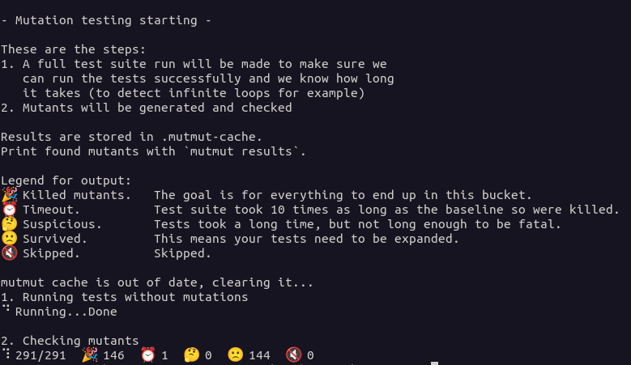
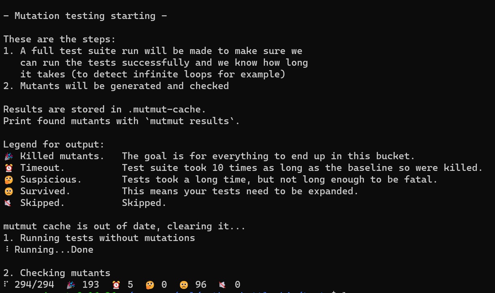

# Analyse et Vérification des Logiciels - Testing

## Projet : Bataille navale simple en Python.

## Membres : 
- Quentin Bouchard
- Thomas Brunet
- Enzo Pain
- Jérémy Nison

## Usage : 

### Lancement et déroulement d'une partie : 
Voir le [readme](README.md).

### Tests
Nos tests reposent sur le module standard [unittest](https://docs.python.org/3/library/unittest.html), permettant d'avoir accès à de nombreuses méthodes de tests, notamment des assertions.

Pour lancer les tests d'une classe, placez vous dans le dossier `tests/` et executez la commande `python3 <nom_de_la_classe_de_tests>.py`

## Rapport :

### Descisions prises : 
Pour tester le projet, nous avons commencé par écrire les tests les plus simples (tests unitaires basiques). Ensuite, nous avons impleémentés des tests unitaires plus compliqués (avec des mocks ou des valeurs aléatoires par exemple).

Nous devons également écrire des tests "end to end" en simulant dans des tests le déroulement d'une partie de A à Z afin de s'assurer que le jeu fonctionne correctement

Nous avons enfin pour objectif de mettre en place une ou deux techniques de testing avancées : *fuzzing* et *mutation testing*.

### Qu'est ce qui a été testé : 
- Board : (`tests/board_test.py`) :
    - Tests du constructeur :
        - Tests pour s'assurer que l'état initial de la Board correspond bien à celui attendu.
        - Tests dans le cas ou des paramètres incorrects sont passés au constructeur.
    - Tests du placement des bateaux (vertical et horizontal) :
        - Test pour s'assurer qu'un bateau ne peut pas dépasser de la Board.
        - Test pour s'assurer que l'ajout d'un bateau incrémente le nombre de points de vie de la Board par le nombre de points de vie du bateau.
        - Tests pour s'assurer que l'ajout d'un bateau incrémente de 1 le nombre total de bateaux de la Board.
    - Tests de la méthoode shoot :
        - Tests pour s'assurer que la méthode renvoie la bonne réponse en fonction du résultat du tir (Touché (HIT), Coulé (SUNK), Manqué(MISSED))
        - Tests pour s'assurer que la méthode lève une exception si la position visée est en dehors de la Board.
        - Tests pour vérifier que toucher un bateau (HIT) décrémente de 1 le nombre de points de vie total de la Board.
        - Test pour s'assurer que couler un bateau (SUNK) décrémente de 1 le nombre total de bateaux de la Board.
    - Tests de l'affichage de la Board (via la métohde `display()`) :
        -  Tests de l'affichage dans différentes situations : 
            - Board vierge
            - Board avec des cellules marquées MISSED
            - Board avec des cellules marquées HIT
            - reveal de la Board (révéler l'emplacement de tous les bateaux, touchés ou non.)
        
            *La méthode `display()` ne retourne rien, elle affiche directement l'état de la Board sur la sortie standard. Afin de pouvoir vérifier que ce qui est affiché est correct, il faut rediriger la sortie standard de python dans un objet `StringIO`. On peut ensuite appeler la méthode `getvalue()` sur cet objet afin d'avoir sous forme de `str` le contenu qui est cencé être affiché sur la sortie standard. Il suffit enfin de comparer cette chaîne avec une que l'on aura définit à la main, représentant la sortie attendue.*

- main : (`tests/main_test.py`) :
    - Test de la génération aléatoire de position (méthode `generateRandomPosition()`) :
        - Test pour s'assurer que la position générée est comprise dans les limites passées en paramètre :
            - Test avec des limites aléatoires, répété 100000 fois.
        - Tests pour vérifier que la méthode lève une `ValueError` si au moins l'une des deux limites est inférieure à 1.
    - Test de la génération de bateau aléatoire (méthode `generateRandomShip()`): 
        - Test pour vérifier que les points de vie du bateau sont dans la size pool : 
            - Génération aléatoire d'une pool de sizes et d'un bateau(test répété 10000 fois)
    - Test du remplissage aléatoire de la board (méthode `randomPopulate()`):
        - Test pour vérifier que la méthode génère le bon nombre de bateaux
        - Test pour vérifier que la méthode appelle `exit()`si un bateau ne peut pas être placé (plus de place sur la board, ...)
    - Test de la méthode `main()` : 
        - Test avec une taille de Board incorrecte (négative ou nulle)
        - Test avec un nombre de bateaux incorrect (négatif ou nul)
        - Test avec des valeurs incorrectes(str à la place d'int, ...)

        *La méthode `main()` se base sur des valeurs entrées par l'utilisateur pour générer une Board de la taille donnée et y placer le nombre de bateaux entré par l'utilisateur. Afin de simuler l'entrée de données par un utilisateur, nous avons mocké l'entrée standard de python avec la l'annotation `@patch("builtins.input")`. On peut ensuite définir une liste de valeurs qui seront appelées dans l'ordre à chaque fois que l'execution de la méthode nécessite une valeur trouvée sur l'entrée standard.*

- Position (`tests/position_test.py`) :
    - Test du constructeur :
        - Test avec des valeurs correctes
        - Test du levage de l'exception lorsque des valeurs négatives sont passées
        - Test avec des valeur de la forme lettre+nomnbre (A1, B3, ...)
    - Tests unitaires des getters
    - Test unitaire de la méthode `toString()`

- Ship (`tests/ship_test.py`) :
    - Test du constructeur & de la méthode `getLifePoints()`
    - Tests des méthodes `shoot()` et `isSunk()`

- Cell (`tests/cell_test.py`):
    - Test du constructeur
    - Test de `setShip()` et `isEmpty()`
    - Tests de la mtthode `shoot()`:
        - Test pour vérifier que  l'appel a `shoot()` passe l'arrribut `shot` de la cell de False à True
        - Test des différentes valeurs de retour en fonction de l'état de la cellule (MISSED, HIT, ...)
    - Tests de `toString()` : 
        - Tests pour vérifier que la str retournée correspond bien à l'état de la cellule

### Techniques de tests avancées utilisées :

Après avoir réalisé le plus de tests simples possible, nous avons décidé de mettre en place du mutation testing.  
Pour cela, nous avons utilisé mutmut de python.

Nous avons du réaliser une configuration qui se trouve dans `tests/setup.cfg` pour bien préciser comment run tous nos tests.  

Mutmut avait généré 291 mutations en lui laissant utiliser tous les types de mutations.

#### Lancement

	cd tests
	mutmut run

#### Résultats

Sur les 291 mutations, 144 ont survécus.  

Les 109 mutations qui ont survécus viennent de `main.py` et de globalement trois sources : 

- la fonction `randomPopulate` qui n'est pas testée.
- des changements sur la tailles de nos bâteau qui ne sont pas censés impacter notre application
- les tests manquants

#### Continuité

Nous avons donc essayé de travailler sur les autres mutation survivantes pour en réduire le nombres en ajoutant des tests sur les potentiels bugs de notre application.

Après avoir réalisé des tests sur `randomPopulate` et certaines autres fonctions, nous avons réussi à tuer 50 survivants.

### Bilan : 

L'écriture et le lancement des tests nous ont permis de détecter et de régler plusieurs problèmes dans le code source. Certaines fonctions ont du être modifiées afin de pouvoir être testés plus facilement.

- La création d'une position avec des coordonnées négatives lève une exception.
- La fonction `generateRandomPosition` lève une exception si les valeurs limites données en paramètre sont inférieures à 1
- La fonction `generateRandomShip` peut accepter une liste d'int (size pool) en paramètre, afin de pouvoir générer des bateaux en utilisant une taille prise aléatoirement dans la liste.
- catchs d'exceptions dans la fonction `main`
